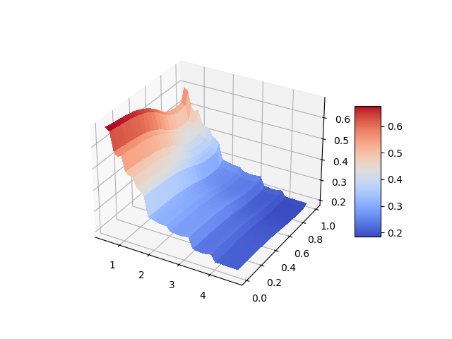
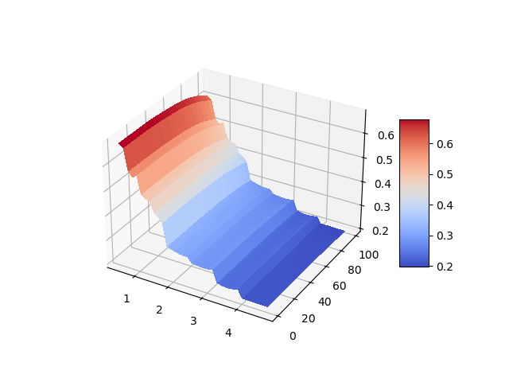

# Volatility Surface Library
This Python library provides functionalities to work with implied **volatility surfaces**. As is well known, volatility surfaces are two-dimensional grids 
where one axis represents the *time to maturity*, and the other axis represents either moneyness (the ratio of the current asset price to
the strike price) or delta (the rate of change of the option price concerning changes in the underlying asset price). Some volatility surfaces 
providers prefer to represent surfaces respect to moneyness, while others respect to delta. This code contains a method that allows to convert
the volatility surface from being dependent on delta to being dependent on moneyness.



## Content
The code contains the following files:
- **VolatilitySurface.py**: this includes two classes:
  - **DeltaVolatilitySurface**: a class that represents a volatility surface that is dependent on *time to maturity* and on *delta*
  - **MoneynessVolatilitySurface**: a class that represents a volatility surface that is dependent on *time to maturity* and on *moneyness*
- **test.py**: a file that contains an example on how to import volatility surface dependent on delta and how to convert it to being dependent on moneyness 
- **utility.py**: a file that contains two utility functions
  - **fixed_point**: a function that performs the *fixed point algorithm*
  - **bisection**: a function that performs the classical *bisection algorithm*

## Prerequisites
Make sure you have the following dependencies installed:
- `scipy`
- `numpy`
- `pandas`
- `matplotlib`

## Usage and examples
This section contains
```python
from VolatilitySurface import DeltaVolatilitySurface as DVF
```

```python
    # Get and Plot Volatility from delta
    path_vol_delta = r'data/ex_vol_on_delta.csv'
    date_format = '%m/%d/%Y'
    dvs = DVF.from_csv(path_vol_delta, # Path that contains the csv with the volatility respect to the delta 
                       trade_date=date(2022, 1, 1), # Trade Date of observation of thevolatility
                       header_conv=lambda x: int(x.replace(' D C', ''))/100, # Function to use to convert the header of the csv to a numeric delta 
                       date_format=date_format) # Dates Format
    dvs.plot()
```

# How to Convert Volatility Surface from Dependent on Delta to Dependent on Moneyness and vice-versa

## Description of the general algorithm
This article is aimed at providing a general method to convert a volatility surface of vanilla European call options
from dependent on delta to dependent on moneyness. A simple algorithm, based on the fixed point algorithm, is described, with 
a focus on Balck's model for options on futures. Some empirical advice are also given, in order to improve the algorithm behaviour.
We suppose to have a volatility surface dependent on delta, so we suppose to have $n\times k$ volatility points $\tilde \sigma_{ij}$ defined for 
delta $\tilde \Delta_i$ with $i = 1,...,n$ and for time-to-maturity $T_j$ with $j = 1 ... k$. Moreover we suppose to have an interpolation 
function $\sigma$ such that $\sigma( \tilde \Delta_i, T_j) = \tilde \sigma_{ij}$. This function can be whatever we prefer to interpolate smiles of
our volatility function (linear interpolation, splines...). We define moneynesses $m_1, m_2, ..., m_h$ of our choice. We know that there exists a function
$\Delta = F(m, T, \sigma)$ which, given a time to maturity $T$, a maturity $m$ and a volatility $\sigma$, returns the associated $\Delta$. 
Function $F$ can be easily derived from the option delta formula (for both Black and Scholes's model and Black's model). By substituting the 
interpolation function in $\sigma$ we obtain that
```math
    \Delta = F(m, T, \sigma(\Delta, T))
```
For each pair $m_i, T_j$ we look for $\delta_{ij}$ such that the following holds
```math
    \delta_{ij} = F(m_i, T_j, \sigma( \delta_{ij}, T_j))
```
Finding $\delta_{ij}$ that solves this equation, means solving a fixed point problem $f(x) = x$ or a zero-finding problem $f(x)-x = 0$ where
$f(x) = F(m_i, T_j, \sigma(x, T_j))$. Once the problem has been solved for all pairs $m_i, T_j$, we can define the values of the new volatility 
surface as $\rho_{ij} = \sigma(\delta_{ij}, T_j)$. Therefore the new volatility surface is 
```math
    (m_i, T_j) \rightarrow \rho_{ij}
```
Once $\rho_{ij}$ has been calculated, we have a surface in 2 dimensions dependent on moneyness.

## The case of Black's model
In this section we treat the case of options on futures, and thus the case of the Black's model. The delta of an option in Black's model is 
```math
    \Delta = e^{-rT}\Phi(d_1)
```
with
```math
    \Phi(x) = \frac{1}{\sqrt{2\pi}}\int_{-\infty}^x e^{-\frac{1}{2}t^2} dt,\quad d_1 = \frac{\ln{\frac{S}{K}} + \frac{1}{2}\sigma^2T}{\sigma\sqrt{T}}
```
where $r$ is the interest rate and $T$ the maturity of the option, $S$ the price of the underlying future, $K$ the strike of the option and $\sigma$ 
the volatility of $S$. We define the moneyness $m = \frac{S}{K}$ and, from delta formula we obtain that
```math
    \Delta(m, T, \sigma)= e^{-rT}\Phi(d_1(m, T, \sigma))
```
We suppose to have a volatility surface depending on delta, i.e. an interpolation function $\sigma$ such that $\sigma(\Delta_i, T_j) =\tilde \sigma_{ij}$, 
and we suppose we have to convert the surface to be dependent on moneynesses $m_1, m_2, ..., m_h$. For each pair $(m_i, T_j)$ we have to find
$\delta_{ij}$ such that
```math
    \delta_{ij}= e^{-rT}\Phi(d_1(m_i, T_j, \sigma(\delta_{ij}, T_j))
```
Now the volatility surface, in $(m_i, T_j)\rightarrow\rho_{ij} $ where $\rho_{ij} = \sigma(\Delta_i, T_j)$. This defines the grid of points 
of the volatility surface, but obviously, another interpolation funcion must be defined also for theese point. This means defining a function 
$\rho(m, T)$ such that $\rho(m_i, T_j) = \rho_{ij}$. Once again all the choices among the interpolation algorithm are possible.

## Empirical considerations
As explained, the problem is reduced to solve a fixed point problem. One of the most popular and simple algorithm for the solution of the fixed point problem is the *fixed point algorithm*. If works as follows: let's suppose we have to find $x$ such that $f(x)=x$ where $f$ is a continuous function. Chosen an initial point $x_0$ we define
```math
    x_{n+1} = f(x_{n})
```
It is obvious that if $x_n$ has limit, the limit is a fixed point for $f$. This simple algorithm is called fixed point algorithm. Under the assumption that $f$ is Lipschitz continuous in an interval $I$, with Lipschitz constant less that $1$, the fixed point algorithm converges to the unique fixed point of $f$, given $x_0 \in I$. Unfortunately, we can
easily see that the function in \eqref{fct}, even though $\sigma$ is constant, is not Lipschitz continuous with Lipschitz constant less that $1$. Despite the convergence is not guaranteed for \eqref{fct}, the algorithm often converges with real data volatility in few iterations. This is due to the fact that \eqref{fct} is locally Lipschitz continuous if the volatility surface does not have strong variations in $\sigma_{ij}$. Therefore this algorithm is strongly recommended.
Some other empirical considerations:

- **How to choose $x_0$**: It is easy to see that the delta in Black's Framework is less than $e^{-rT}$ since $\Phi$ is a cumulative density function and thus $\Phi<1$. Therefore $e^{-rT}\Phi(d_1)$ has a fixed point in $(0, e^{-rT})$ and we can set $x_0 = e^{-rT}$
- **What can we do if the algorithm does not converge**: in case the fixed point algorithm does not converge, we can reformulate our problem as a zeros-finding problem. We define $g(x) = f(x) - x$ and we can look for a zero of $g$ with any of the zero-finding algorithm, like bisection (recommended for its generality), secant method, Newton method... These methods can be implemented in the interval $(0, e^{-rT})$
- **Smile interpolation**: It is recommended to use a linear interpolation as interpolation function $\sigma$, because of its simple and predictable behaviour, in both volatility surface dependent on delta and on moneyness
- **How to invert the procedure**: Function $F$ can be *inverted* respect to $m$, in the sense that there exists $H$ such that $m = H(\Delta, T, \sigma)$. We can repeat the same procedure described in this article by using $H$ and by inverting the role of $m$ and $\Delta$: we obtain a procedure to convert a volatility surface dependent on moneyness to one dependent on delta.

